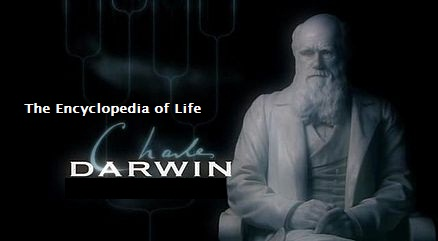
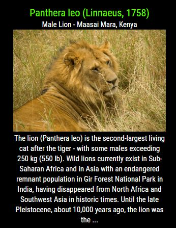
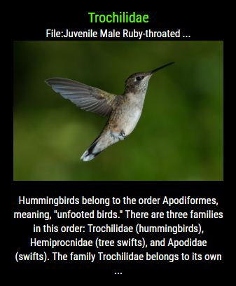
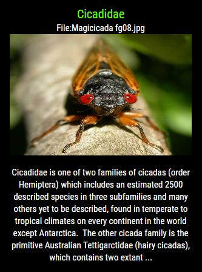

## MMM-EOL

## The Encyclopedia of Life

## Here's what you get

* First, you are greeted by Charles Darwin on the cover of the encyclopedia.

* Then, a rotation of images and information about the life form you choose.

* Virtually every form of life on Earth to choose from. (Plants, Fish, Mammals, Reptiles etc..)

* I will add life forms as requested. There's just too many to include all of them.

* "Cats" will include ALL cats, or you can choose a specific species. (Lions, Tigers, etc..)

## Examples

   

## Installation

* `git clone https://github.com/mykle1/MMM-EOL` into the `~/MagicMirror/modules` directory.

* No API key needed. No dependencies. No kidding!

* Annotated .css file included for sizing and coloring.

## Config.js entry and options

    {
        module: 'MMM-EOL',                  // Best in left, right or center regions
        position: 'top_left',
        config: {
           lifeForm: "",                    // See Life Form list below
           dLength: 400,                    // Length of descriptive text
           useHeader: false,                // false if you don't want a header      
           header: "",                      // Change in config file. useHeader must be true
           maxWidth: "300px",
           animationSpeed: 0,               // no fade (increase for transition)
           rotateInterval: 1 * 60 * 1000,   // 1 minute
        }
    },

## Life form list
* If you want something included I will add it ASAP. Just let me know.

* "Alligators"
* "Anemones and Corals"
* "Bald Eagle"
* "Bats"
* "Bears"
* "Birds"
* "Cactus"
* "Cardinals"
* "Cats"
* "Cheetah"
* "Cicadas"
* "Crabs, Lobsters, and Shrimps"
* "Crocodiles"
* "Deaths-head Moth"
* "Dragonfly"
* "Eagles"
* "Fox"
* "Great White Shark"
* "Hummingbirds"
* "Humpback Whale"
* "Jaguar"
* "Leopard"
* "Lions"
* "Mosquitos"
* "Praying Mantis"
* "Seals"
* "Sea Horse"
* "Sequoia"
* "Snakes"
* "Striped Bass"
* "Tarantulas"
* "Tigers"
* "Venus Flytrap"

* This is just a small sample of the data available

## Remember, I'll add anything you wish to the module
	
## That's right, SpaceCowboysDude rescued me again on this one
